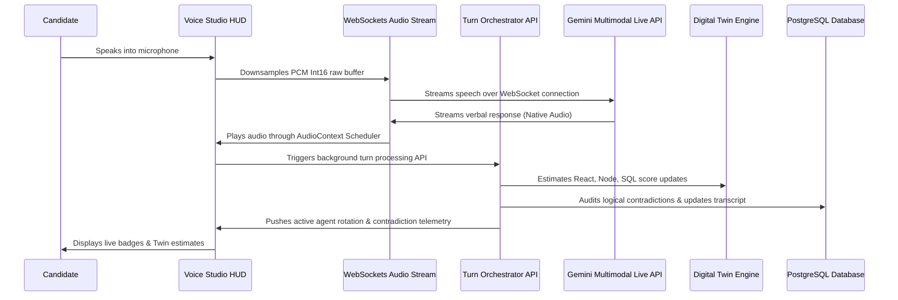

# InterviewOS AI — The Intelligent AI Interview Operating System
### Deployed Production Link: **[https://interview-platform-one-xi.vercel.app](https://interview-platform-one-xi.vercel.app)**

InterviewOS AI is a premium, real-time AI recruitment and technical evaluation platform modeled on the styling languages of Apple, Linear, Stripe, and Vercel. Candidates engage in real-time low-latency voice interviews with an AI panel, solve programming challenges in an active sandbox, and receive detailed candidate genome reports backed by interactive skill constellation maps.

---

## 🚀 Fully Implemented Features

### 1. Low-Latency WebRTC Voice Streaming
* Programmed a direct WebSocket audio bridge using `models/gemini-2.5-flash-native-audio-latest`.
* Integrates double-buffered queue schedulers and look-ahead playbacks to avoid audio glitches or clipping.

### 2. Multi-Agent AI Panel Rotation
* Automatically cycles interviewer personas (**CTO**, **Senior Engineer**, and **Hiring Manager**) dynamically based on question depth.
* Displays glowing agent highlight badges inside the Voice Studio HUD.

### 3. Live AI Digital Twin (Candidate Twin)
* Evaluates candidate skill estimates (React, Node, SQL, System Design, Leadership, Communication) in real-time.
* Shows active estimation telemetry in the sidebar as the candidate speaks.

### 4. Real-Time Contradiction Detector
* Analyzes transcripts in the background to detect self-contradictions against prior answers.
* Displays floating warning alerts inside the Voice Studio HUD.

### 5. Drag-and-Drop Ingestion (Multimodal Resumes)
* Custom file upload field supporting PDFs/Docx drag-and-drop.
* Gemini parses uploaded profiles multimodally to customize the interview questions.

### 6. Interactive Coding & SQL Sandbox
* Active code editor enabling candidates to solve coding structures or write database queries side-by-side during calls.
* Logs execution output and checks complexity stats.

### 7. Living Interview Universe (SVG Constellation Map)
* Renders a glowing SVG star galaxy on final reports.
* Node scale and brightness match metrics, interconnected by glowing constellation links.

### 8. Integrity & Focus Telemetry
* Background telemetry tracking screen blur events, tab switching, and clipboard actions.
* Records and saves integrity grades to prevent mock interview cheating.

### 9. Candidate Genome & Match Forecast
* Radar charts mapping multi-dimensional performance.
* Company readiness gauges forecasting candidate alignment with Google, Amazon, Stripe, and Netflix.

### 10. Design System Gallery Showcase
* Visual component library located at `/design-system` containing interactive cards, buttons, and docks.

### 11. Custom Stretching Spotlight Cursor
* Custom cursor trail that stretches into capsule pills on interactive links and buttons.

### 12. CosmoQ UI Branding & Spacing Layouts
* Series-A style dark mode theme utilizing custom color tokens, mesh grids, and ambient glows.

---

## 🛠️ The Tech Stack
* **Frontend**: Next.js 16 (App Router), TypeScript, Tailwind CSS, Framer Motion, Recharts, Lucide Icons
* **Database**: PostgreSQL (via Neon Serverless), Prisma ORM
* **AI Pipelines**:
  * **Gemini Multimodal Live API (`models/gemini-2.5-flash-native-audio-latest` over WebSockets)**: Delivers low-latency bi-directional voice streams.
  * **Gemini Developer API (`gemini-2.5-flash`)**: Handles candidate profiling, turn evaluation, contradiction checking, and report synthesis.
* **Audio Engineering**: Downsamples browser microphone input from native hardware rates to 16kHz PCM Int16. Double-buffered queue scheduler avoids verbal click artifacts.

---

## 🚀 Local Setup (In 3 Commands)

Run the entire platform locally with these simple commands:

### 1. Install dependencies
```bash
npm install
```

### 2. Setup environment variables & database schema
Copy the `.env` template, insert your credentials (`DATABASE_URL`, `JWT_SECRET`, `GEMINI_API_KEY`), and push the schema:
```bash
cp .env.example .env && npx prisma db push
```

### 3. Boot the development server
```bash
npm run dev
```
The application will boot at **[http://localhost:3000](http://localhost:3000)**.

---

## 🔄 Core Loop Flow (End-to-End)



---

## 🎨 CosmoQ Premium Design System
InterviewOS implements a customized design system. Preview, interact, and copy components at:
👉 **`/design-system`** (Preview Glass Cards, Waveform oscillators, AI Core Orbs, and button gradients).
