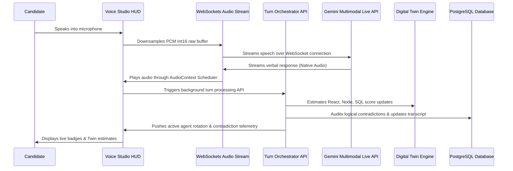

# InterviewOS AI — The Intelligent AI Interview Operating System
### Deployed Production Link: **[https://interview-platform-one-xi.vercel.app](https://interview-platform-one-xi.vercel.app)**

InterviewOS AI is a premium, real-time AI recruitment and technical evaluation platform modeled on the styling languages of Apple, Linear, Stripe, and Vercel. Candidates engage in real-time low-latency voice interviews with an AI panel, solve programming challenges in an active sandbox, and receive detailed candidate genome reports backed by interactive skill constellation maps.

---

## 🚀 Key Architectural Pillars

### 1. Multi-Agent AI Panel Rotation
Instead of a single voice interviewer, candidates face an active panel consisting of a **Senior Engineer**, a **CTO**, and a **Hiring Manager**.
* **CTO Persona**: Directs architecture scaling questions and cost trade-offs.
* **Senior Engineer**: Probes low-level coding details, API design, and syntax paradigms.
* **Hiring Manager**: Evaluates team alignment, leadership qualities, and conflict resolution.
* *How it works*: A background orchestrator monitors conversation depth and dynamically rotates the `activeAgent` in real-time, flashing agent badges in the active Voice Studio HUD.

### 2. Live AI Digital Twin (Knowledge Model)
As the candidate speaks, a background worker updates a multidimensional estimation of the candidate's core competencies:
* Evaluates metrics: **React/Frontend**, **Node/Backend**, **SQL/Databases**, **System Design**, **Leadership**, and **Communication**.
* Renders a real-time knowledge twin widget in the Voice Studio HUD, adjusting estimates after each turn to target high-value knowledge gaps.

### 3. Real-Time Contradiction Detector
Evaluates verbal inputs against previous answers:
* Audits the conversation history database to find logical inconsistencies.
* Instantly triggers floating warning telemetry alerts in the candidate's interface if they contradict their previous experiences.

### 4. Living Interview Universe (Stellar Skill Constellation)
* Renders a galactic constellation map inside the evaluation report.
* Employs interactive SVG stars representing skills, where star size and glowing halo pulse frequency correlate directly to the candidate's scoring metrics.

### 5. Drag-and-Drop Document Ingestion
* Fully integrated drag-and-drop document upload interface (PDF/Docx) for candidate resumes and job descriptions.
* Leverages Google Gemini's multimodal parsing capability to parse document buffers directly and synthesize candidate baseline profiles.

---

## 🛠️ The Tech Stack
* **Frontend**: Next.js 16 (App Router), TypeScript, Tailwind CSS, Framer Motion, Recharts, Lucide Icons
* **Database**: PostgreSQL (via Neon Serverless), Prisma ORM
* **AI Pipelines**:
  * **Gemini Multimodal Live API (`models/gemini-2.5-flash-native-audio-latest` over WebSockets)**: Delivers low-latency bi-directional voice streams.
  * **Gemini Developer API (`gemini-2.5-flash`)**: Handles candidate profiling, turn evaluation, contradiction checking, and report synthesis.
* **Audio Engineering**: Downsamples browser microphone input from native hardware rates to 16kHz PCM Int16. Double-buffered queue scheduler avoids verbal click artifacts.

---

## 🚀 Local Setup (In 3 Commands)

Run the entire platform locally with these simple commands:

### 1. Install dependencies
```bash
npm install
```

### 2. Setup environment variables & database schema
Copy the `.env` template, insert your credentials (`DATABASE_URL`, `JWT_SECRET`, `GEMINI_API_KEY`), and push the schema:
```bash
cp .env.example .env && npx prisma db push
```

### 3. Boot the development server
```bash
npm run dev
```
The application will boot at **[http://localhost:3000](http://localhost:3000)**.

---

## 🔄 Core Loop Flow (End-to-End)



---

## 🎨 CosmoQ Premium Design System
InterviewOS implements a customized design system. Preview, interact, and copy components at:
👉 **`/design-system`** (Preview Glass Cards, Waveform oscillators, AI Core Orbs, and button gradients).
